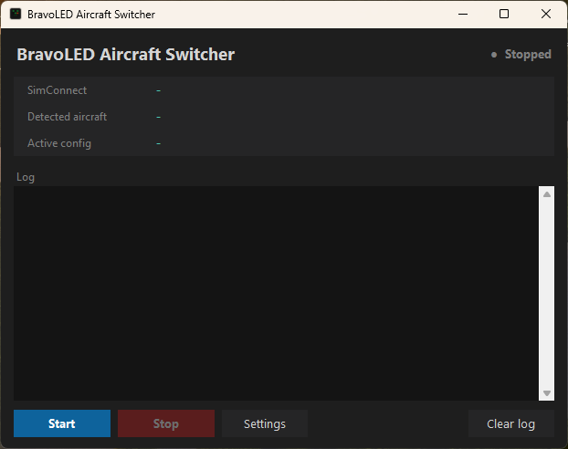
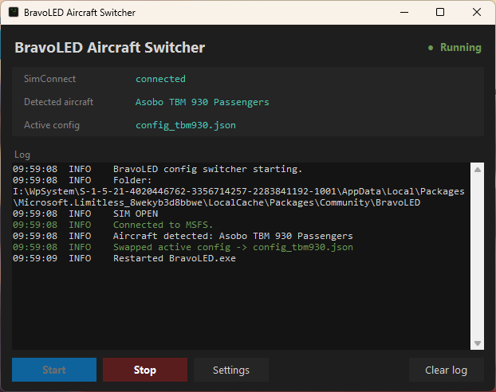

# BravoLED Aircraft Config Switcher

Automatic per-aircraft annunciator/LED configs for the **Honeycomb Bravo Throttle Quadrant** on **Microsoft Flight Simulator 2024**, using Honeycomb's official 2025 **BravoLED** driver.

The 2025 BravoLED driver only ever loads a single `config.json` and has no aircraft awareness, so the same oil-pressure, fuel-pressure and gear thresholds get applied to every aircraft you fly. A piston GA threshold is simply wrong for a turboprop or an airliner, which leaves annunciator lights stuck on or never lighting at all. This tool watches the sim, detects which aircraft you load, swaps in the matching config, and restarts the driver so the correct lights come up automatically.

It also fixes a bug in Honeycomb's stock config (see [The index fix](#the-index-fix) below) that affects everyone, not just multi-config users.

> Not affiliated with or endorsed by Honeycomb Aeronautical. "Honeycomb", "Bravo" and "BravoLED" are used only to describe compatibility.

---

## Download

**Most people want the ready-to-run app:** grab the latest `BravoSwitcher.exe` from the [**Releases**](../../releases) page. No Python, no setup — see [Quick start (app)](#quick-start-app).

Prefer to run or modify the Python source instead? See [Run from source](#run-from-source).

---

## Why this exists

- **Better Bravo Lights** (the popular community tool) does not work with MSFS 2024.
- Honeycomb's 2025 BravoLED driver works with MSFS 2024 but is undocumented and single-config.
- Nothing currently bridges that gap with per-aircraft switching for the new driver.

This is a small, dependency-light tool that does exactly that.

---

## Features

- Detects the loaded aircraft via SimConnect (reads the `TITLE` from `aircraft.cfg`).
- Swaps in a per-aircraft config and restarts BravoLED automatically on aircraft change.
- Falls back to a sensible default config when no rule matches.
- Small GUI to start/stop, view connection state, see the detected aircraft and active config, and watch a live log.
- **Settings window** to add/edit/reorder aircraft rules and toggle debug mode, no file editing or rebuild required — works the same in the exe and from source.
- Built-in **debug mode** that prints live SimVar values so you can tune your own thresholds.
- Corrected default config that fixes the indexed-SimVar bug in Honeycomb's stock file.
- Ships as a single standalone `.exe` (no Python needed), or runs from source if you prefer.

---

## Screenshots




---

## Requirements

- Windows 10 or 11
- Microsoft Flight Simulator 2024
- Honeycomb Bravo Throttle Quadrant with the **BravoLED** driver installed (MSFS 2024 version)

The standalone `.exe` needs nothing else. Running from source additionally needs [Python 3](https://www.python.org/downloads/) (3.10+) and the `SimConnect` library (plus `pywin32`, which it relies on).

---

## Quick start (app)

This is the recommended path for most users.

1. Download `BravoSwitcher.exe` from the [Releases](../../releases) page.
2. Place it inside your BravoLED folder, alongside `BravoLED.exe`. For the MS Store / Game Pass install that folder is typically:

   ```
   %LOCALAPPDATA%\Packages\Microsoft.Limitless_8wekyb3d8bbwe\LocalCache\Packages\Community\BravoLED\
   ```

   (The Steam install path differs; search your Community folder for `BravoLED`.)
3. Put the config files from this repo in the same folder:

   ```
   BravoLED\
       BravoLED.exe          (already there - the driver)
       config.json           (already there - gets overwritten automatically)
       config_default.json   (from this repo - the fixed fallback config)
       config_tbm930.json    (from this repo - example aircraft config)
       BravoSwitcher.exe     (from Releases)
   ```

   A `settings.json` (holding your aircraft rules and debug toggle) is created automatically next to the exe on first run; you edit it through the Settings window, not by hand.
4. Double-click `BravoSwitcher.exe`, click **Start**, and launch a flight in MSFS 2024.

From there it is automatic. When you load or change aircraft the tool detects it, swaps the matching config, and restarts the driver. Expect a brief LED flicker on aircraft change — that is the driver reloading, and is normal.

> **First launch is a few seconds slow.** The single-file exe unpacks itself to a temp folder on startup. This only affects the first open of each session.
>
> **Possible antivirus false positive.** PyInstaller-built exes are sometimes flagged by Windows Defender or others. This is a known false positive for this kind of app; the full source is in this repo and you can build the exe yourself (see below) if you prefer.

> **Important:** once the switcher is running, `config.json` is a throwaway file that gets overwritten on every aircraft change. Treat the `config_*.json` files as your source of truth. Do not hand-edit `config.json` directly.

The GUI shows:

- **SimConnect** — connection state (waiting / connected / disconnected)
- **Detected aircraft** — the exact `TITLE` string the sim reports
- **Active config** — which `config_*.json` is currently loaded
- **Log** — live output

and the **Settings** button opens an editor for your aircraft rules and the debug toggle (see [Adding your own aircraft](#adding-your-own-aircraft)).

---

## Run from source

Only needed if you want to run the Python directly or modify it.

### 1. Install Python

Download from [python.org](https://www.python.org/downloads/) and run the **standalone Windows installer (64-bit)**. On the first screen of the installer:

- **Check "Add python.exe to PATH"** (it is unchecked by default — this matters).
- "Install for all users" is recommended so Python lands in `C:\Program Files\Python3xx\` rather than a per-user AppData path. Per-user installs can cause launcher path errors.

Verify in a **new** Command Prompt:

```
python --version
pip --version
```

### 2. Install the Python libraries

```
pip install SimConnect
pip install pywin32
```

Verify:

```
python -c "import SimConnect; print('OK')"
```

### 3. Drop the source files into your BravoLED folder

```
BravoLED\
    BravoLED.exe                 (already there - the driver)
    config.json                  (already there - gets overwritten automatically)
    config_default.json          (from this repo - the fixed fallback config)
    config_tbm930.json           (from this repo - example aircraft config)
    bravo_config_switcher.py     (from this repo)
    bravo_switcher_gui.py        (from this repo)
    Start BravoLED Switcher.bat  (from this repo)
```

Then double-click **`Start BravoLED Switcher.bat`** (or run `python bravo_switcher_gui.py`), click **Start**, and launch a flight.

You can also run the switcher headless with no window via `python bravo_config_switcher.py`. A `settings.json` is created automatically on first run; edit it through the Settings window (or by hand).

### 4. (Optional) Build your own exe

```
pip install pyinstaller
python -m PyInstaller bravo_switcher.spec
```

The finished app appears at `dist\BravoSwitcher.exe`. The included `bravo_switcher.spec` bundles the SimConnect runtime DLL and the lazily-imported SimConnect/pywin32 modules, which a plain PyInstaller invocation would otherwise miss.

---

## Adding your own aircraft

Aircraft rules live in `settings.json` (created automatically next to the app), and you edit them right from the GUI — no file editing and no rebuild, whether you use the exe or run from source.

1. Load the aircraft in MSFS with the switcher running and read the **Detected aircraft** line in the GUI — that is the exact title string to match against.
2. Copy an existing config (e.g. `config_default.json`) to a new file such as `config_yourplane.json` and adjust the thresholds.
3. Click **Settings → Add**, enter a match string and pick (or type) the config file, then **OK**.

Each rule is a **match string** and a **config file**. Matching is a **case-insensitive substring** of the aircraft title, and rules are checked top to bottom — the first match wins, so use the **Up/Down** buttons to put more specific rules above more general ones. `TBM 930` matches every TBM 930 livery, for example. The Settings window also has **Edit** and **Remove**, and every change is saved immediately and picked up by a running switcher on its next aircraft change (no restart needed).

If you'd rather edit `settings.json` directly, it's plain JSON:

```json
{
    "debug": false,
    "rules": [
        {"match": "TBM 930",   "config": "config_tbm930.json"},
        {"match": "Baron G58", "config": "config_baron58.json"}
    ]
}
```

---

## Multi-engine aircraft

The engine SimVars are indexed per engine: `:1` is engine 1, `:2` is engine 2, and so on. For a twin, four-engine airliner, etc., add a separate SimVar entry for each engine. Each entry must have a **unique label** — the driver rejects duplicate labels (`SimVar label '...' is defined more than once`), so you cannot reuse `ENG_OIL_PS` for all of them:

```json
{ "label": "ENG_OIL_PS_1", "datum": "GENERAL ENG OIL PRESSURE:1", "units": "psf" },
{ "label": "ENG_OIL_PS_2", "datum": "GENERAL ENG OIL PRESSURE:2", "units": "psf" }
```

Then reference them in the LED trigger so the annunciator lights if any engine is affected. The `&` (AND) operator is confirmed to work in the stock config (`GEAR_L > 0 & GEAR_L < 1`). An OR operator (`|`) is the natural way to express "any engine low" and is likely supported, but has not been verified here — test it and confirm before relying on it:

```json
{ "LED": 16, "trigger": "ENG_OIL_PS_1 < 2000 | ENG_OIL_PS_2 < 2000" }
```

If `|` turns out not to be supported by the driver's parser, an alternative is to keep a single representative engine, or to define one LED rule per engine where the hardware allows.

---

## Tuning thresholds (debug mode)

Pressure and similar values differ wildly between aircraft, and MSFS does not always report them in obvious units. To see the real numbers your aircraft produces:

1. Click **Settings** and turn **Debug mode** ON.
2. Load a flight (or change aircraft).

Every ~15 seconds it prints a snapshot to the log like:

```
---- SimVar debug snapshot ----
  Oil pressure (eng1)    16210.9651  (psf)
  Fuel pressure (eng1)   15.0000     (psi)
  Suction                0.0000      (inhg)
  ...
--------------------------------
```

The toggle takes effect live on the next poll — no restart needed. Watch the values at idle and at cruise, then set a threshold comfortably outside the normal range in your config (for a low-pressure warning, set it just below normal operating pressure). Turn Debug mode OFF again when you are done.

> **Units gotcha:** the SimConnect library reports `GENERAL ENG OIL PRESSURE` in **psf** (pounds per square foot), not psi. 1 psi ≈ 144 psf. The example TBM config keeps `psf` and uses the raw psf value in its threshold — match whatever the debug output shows.

---

## The index fix

Honeycomb's stock `config.json` references engine SimVars **without an engine index**, e.g.:

```json
"datum": "GENERAL ENG OIL PRESSURE"
```

These are *indexed* SimVars. Without an index they do not resolve, read as `0`, and make the LOW OIL PRESSURE, LOW FUEL PRESSURE, ENGINE FIRE and STARTER lights misbehave (typically stuck on). The corrected `config_default.json` in this repo adds the `:1` engine index to all four:

```json
"datum": "GENERAL ENG OIL PRESSURE:1"
```

This fix applies to **everyone** using the stock driver, single-engine GA included, so the included default is a drop-in improvement even if you never use per-aircraft switching.

---

## How it works

`bravo_config_switcher.py` connects to MSFS via SimConnect and polls the `TITLE` SimVar. On an aircraft change it copies the matching `config_<name>.json` over `config.json`, then runs `taskkill` on `BravoLED.exe` and relaunches it so the driver reloads the new config. Aircraft rules and the debug toggle are read from `settings.json` on every poll, so edits made in the Settings window take effect live. The GUI (`bravo_switcher_gui.py`) imports the switcher and runs it in a background thread, capturing its log output for display — so the command-line switcher also works standalone, and the same code powers the bundled exe.

---

## Troubleshooting

**The exe won't start, or antivirus quarantined it**
Likely a false positive (see [Quick start](#quick-start-app)). Restore/allow it, or build from source yourself.

**(Source) Double-clicking the .bat asks "how do you want to open this file?"**
Python isn't on PATH. Re-run the Python installer, choose Modify, and enable "Add python.exe to PATH".

**(Source) `Fatal error in launcher: Unable to create process ... python.exe`**
A broken or partial Python install, common with per-user AppData installs. Uninstall all Python entries from Settings → Apps, then reinstall with "Install for all users" checked.

**(Source) `pyinstaller` is not recognized**
The Scripts folder isn't on PATH. Use `python -m PyInstaller bravo_switcher.spec` instead.

**GUI shows "waiting for sim" forever**
MSFS isn't running, or SimConnect isn't available yet. The tool will connect on its own once the sim is up.

**An LED is stuck on and the value clearly shouldn't trigger it**
The SimVar probably isn't resolving (reads as 0). Turn on debug mode in **Settings** and confirm the value is real. If it reads `n/a`, the datum likely needs an engine index (`:1`) — see [The index fix](#the-index-fix).

**Config edits don't take effect**
The driver only reloads on an aircraft change or a Start/Stop of the switcher. After editing a config, Stop then Start the switcher, or change aircraft.

---

## Credits

- Honeycomb Aeronautical for the Bravo hardware and BravoLED driver.
- The [Python-SimConnect](https://pypi.org/project/SimConnect/) library.
- Inspired by the original Better Bravo Lights project, which does not support MSFS 2024.

## License

MIT. See `LICENSE`. Provided as-is with no warranty; you are modifying files used by third-party software at your own risk. Back up your original `config.json` before use.
